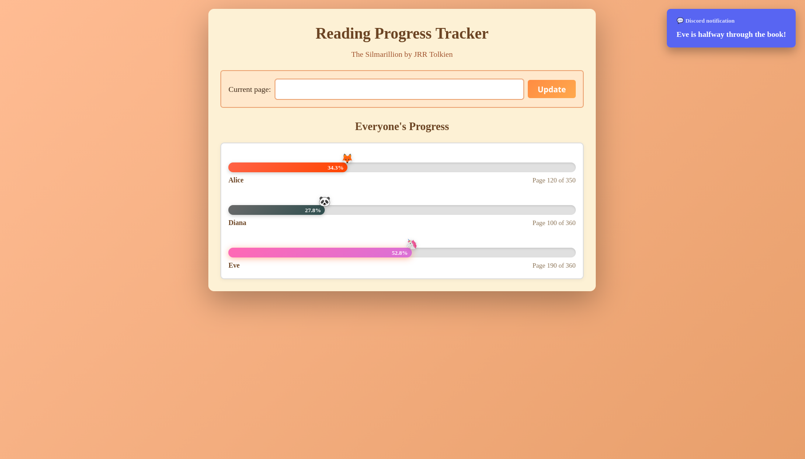

# Book Club Tracker

A collaborative Progressive Web App (PWA) for book clubs to track reading progress in real-time. Built with vanilla JavaScript frontend and Cloudflare Workers backend.

**This is a personal and informal project**: it's designed for small groups of trusted friends. Since everything is kept simple, it's pretty easy to mess up data if someone decides to, so keep that in mind.


## Features

- **Real-time Progress Tracking**: See everyone's reading progress at a glance
- **Progressive Web App**: Install on mobile devices for a native-like experience
- **Animated Progress Bars**: Emoji markers and colored progress bars
- **Offline Support**: Service worker caches static assets
- **Discord Notifications**: Optional milestone notifications (50%, 75%, 90%)
- **Zero Dependencies**: Pure vanilla JavaScript frontend
- **Serverless**: Cloudflare Workers + KV backend

## Demo



## Architecture

```
reading-progress-tracker/
├── frontend/           # Static PWA files
│   ├── index.html      # Main application
│   ├── sw.js           # Service worker
│   ├── manifest.json   # PWA manifest
│   ├── icon-192.png    # App icon (192x192)
│   └── icon-512.png    # App icon (512x512)
└── worker/             # Cloudflare Worker API
    ├── src/
    │   └── index.js    # Worker code
    ├── wrangler.jsonc  # Cloudflare configuration
    └── package.json
```

## Quick Start

### Prerequisites

- [Node.js](https://nodejs.org/) (v18+)
- [Cloudflare account](https://dash.cloudflare.com/sign-up) (free tier works)
- [Wrangler CLI](https://developers.cloudflare.com/workers/wrangler/install-and-update/)

### 1. Deploy the Worker API

```bash
# Navigate to worker directory
cd worker

# Install dependencies
npm install

# Login to Cloudflare
wrangler login

# Create a KV namespace
wrangler kv namespace create READING_DB
# Copy the ID from the output

# Update wrangler.jsonc with your KV namespace ID
# Replace "YOUR_KV_NAMESPACE_ID_HERE" with the actual ID

# Deploy the worker
npm run deploy
```

After deployment, note your worker URL (e.g., `https://reading-tracker.your-subdomain.workers.dev`).

### 2. Configure the Frontend

Edit `frontend/index.html` and update the `API_BASE` constant:

```javascript
const API_BASE = 'https://reading-tracker.your-subdomain.workers.dev';
```

Also update `frontend/sw.js` to match your worker hostname for proper API caching behavior.

### 3. Host the Frontend

You can host the frontend on any static hosting service:

**GitHub Pages:**
```bash
# Create a new repository and push the frontend folder contents
# Enable GitHub Pages in repository settings
```

**Cloudflare Pages:**
```bash
# Connect your repository to Cloudflare Pages
# Set build output directory to "frontend"
```

**Local Development:**
```bash
cd frontend
python -m http.server 8000
# or
npx serve .
```

## Customization

### Adding/Removing Participants

Edit `worker/src/index.js`:

```javascript
const PARTICIPANTS = [
    "Alice",
    "Bob",
    "Charlie",
    // Add or remove names here
];
```

Update `frontend/index.html` to match:

```html
<select id="select-name">
    <option value="">-- Choose your name --</option>
    <option value="Alice">Alice</option>
    <option value="Bob">Bob</option>
    <!-- Match the names from the worker -->
</select>
```

### Changing Available Emojis

Edit `worker/src/index.js`:

```javascript
const AVAILABLE_EMOJIS = ["📚", "📖", "🦊", "🐻", "🦁", "🐼", "🦄"];
```

### Discord Notifications (Optional)

To enable Discord milestone notifications:

1. Create a Discord webhook in your server
2. Add the webhook as a secret:
   ```bash
   wrangler secret put DISCORD_WEBHOOK
   # Paste your webhook URL when prompted
   ```

Customize notification messages in `worker/src/index.js`:

```javascript
const NOTIFICATION_THRESHOLDS = {
    50: (name) => `📚 **${name}** is halfway through the book!`,
    75: (name) => `💪 **${name}** has reached 75%!`,
    90: (name) => `🔥 **${name}** is at 90%!`
};
```

## API Reference

### Endpoints

| Method | Endpoint | Description |
|--------|----------|-------------|
| GET | `/` | API information |
| POST | `/initialize-reader` | Initialize a reader with total pages |
| POST | `/update-progress` | Update current page |
| GET | `/progress` | Get all readers' progress |
| GET | `/available-emojis` | Get emoji availability |
| POST | `/reset-reader` | Reset reader data (admin) |

### Examples

**Initialize a reader:**
```bash
curl -X POST https://your-worker.workers.dev/initialize-reader \
  -H "Content-Type: application/json" \
  -d '{"name": "Alice", "totalPages": 350, "emoji": "🦊"}'
```

**Update progress:**
```bash
curl -X POST https://your-worker.workers.dev/update-progress \
  -H "Content-Type: application/json" \
  -d '{"name": "Alice", "currentPage": 175}'
```

**Get all progress:**
```bash
curl https://your-worker.workers.dev/progress
```

## PWA Installation

The app can be installed on mobile devices:

1. Open the hosted frontend URL in your mobile browser
2. Tap "Add to Home Screen" (iOS Safari) or the install prompt (Android Chrome)
3. The app will appear as a standalone application

## Tech Stack

- **Frontend**: Vanilla HTML/CSS/JavaScript
- **Backend**: Cloudflare Workers (serverless)
- **Database**: Cloudflare KV (key-value store)
- **Notifications**: Discord Webhooks (optional)

## Development

### Local Worker Development

```bash
cd worker
npm run dev
# Worker runs at http://localhost:8787
```

### Testing

```bash
# Test the worker locally
curl http://localhost:8787/progress
```

## Cost

This project is designed to run within Cloudflare's free tier:
- **Workers**: 100,000 requests/day free
- **KV**: 100,000 reads/day, 1,000 writes/day free

For a small book club, you'll likely never exceed these limits.

## License

MIT License – use it however you want.

## Contributing

Pull requests are welcome if you want to contribute.
